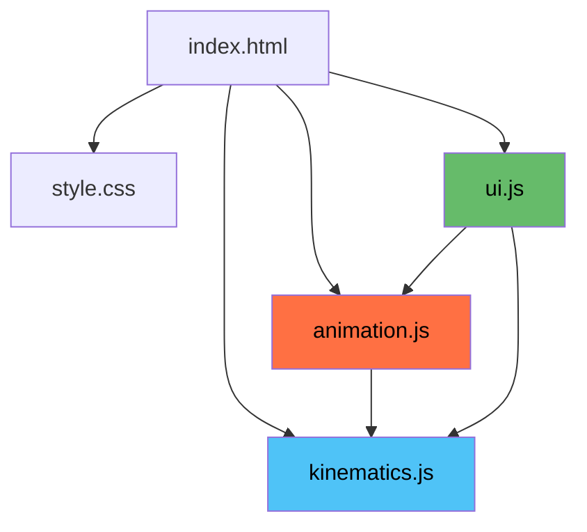

# Four-Bar Mechanism — Coupler Curve Synthesis

> **ME252 Project** — Interactive web application for synthesizing planar four-bar linkage mechanisms from user-defined precision points.


---

## Table of Contents

- [Overview](#overview)
- [Quick Start](#quick-start)
- [How It Works — User Workflow](#how-it-works--user-workflow)
- [Physics & Theory](#physics--theory)
  - [The Four-Bar Linkage](#the-four-bar-linkage)
  - [Coordinate Convention](#coordinate-convention)
  - [Forward Kinematics (Position Analysis)](#forward-kinematics-position-analysis)
  - [Freudenstein's Equation](#freudensteins-equation)
  - [Coupler Curve & Coupler Point](#coupler-curve--coupler-point)
  - [Grashof's Criterion](#grashofs-criterion)
  - [Assembly Modes (Branches)](#assembly-modes-branches)
- [Synthesis Algorithms](#synthesis-algorithms)
  - [4-Point Coupler Curve Synthesis](#4-point-coupler-curve-synthesis)
  - [5-Point Coupler Curve Synthesis](#5-point-coupler-curve-synthesis)
  - [Levenberg–Marquardt Solver](#levenbergmarquardt-solver)
  - [Multi-Start Strategy](#multi-start-strategy)
- [Application Architecture](#application-architecture)
  - [Module Dependency Graph](#module-dependency-graph)
  - [Module Breakdown](#module-breakdown)
  - [Data Flow](#data-flow)
- [File Structure](#file-structure)
- [Features](#features)
- [Technologies Used](#technologies-used)

---

## Overview

This application allows users to interactively synthesize a **planar four-bar linkage mechanism** whose coupler point traces a curve passing through a set of user-defined **precision points** (4 or 5). The core problem solved is:

> *Given N points in the plane, find the dimensions and pivot locations of a four-bar linkage such that a specific point on its coupler link passes through all N points during the mechanism's motion.*

The entire application runs client-side in the browser — no server, no dependencies, no build step.

---

## Quick Start

```bash
# Clone or download the project, then serve it locally:
cd me252_project
python3 -m http.server 8080

# Open in browser:
# http://localhost:8080
```

Alternatively, simply open `index.html` directly in any modern browser.

---

## How It Works — User Workflow

```
┌──────────────────────────────────────────────────────────────┐
│  1. SELECT MODE                                              │
│     Choose 4-Point or 5-Point synthesis from the sidebar.    │
│                                                              │
│  2. PLACE PRECISION POINTS                                   │
│     Click on the canvas to place points, or enter exact      │
│     coordinates in the Manual Coordinates panel.             │
│     Drag existing points to adjust. Right/middle-click       │
│     to pan, scroll-wheel to zoom.                            │
│                                                              │
│  3. SYNTHESIZE                                               │
│     Click the ⚙ Synthesize button. The optimizer runs and    │
│     computes the mechanism dimensions (a, b, c, d, p, q)     │
│     and ground pivot locations (A₀, B₀).                     │
│                                                              │
│  4. INSPECT RESULTS                                          │
│     The Mechanism Parameters panel shows all link lengths,   │
│     coupler offsets, Grashof classification, residual error,  │
│     and ground pivot coordinates.                            │
│                                                              │
│  5. ANIMATE                                                  │
│     Press ▶ Play to watch the mechanism move. The coupler    │
│     curve is drawn in purple; a live trace follows the       │
│     coupler point. Adjust speed with the slider.             │
│                                                              │
│  6. EXPORT / IMPORT                                          │
│     Save the mechanism to a JSON file or load a previous     │
│     design.                                                  │
└──────────────────────────────────────────────────────────────┘
```

---

## Physics & Theory

### The Four-Bar Linkage

A **four-bar linkage** is the simplest closed-loop planar mechanism. It consists of four rigid links connected by four revolute (pin) joints:

```
        A ─────────────── B
       /  (coupler, b)     \
      / (crank, a)          \ (rocker, c)
     /                       \
    A₀ ─────────────────── B₀
         (ground, d)
```

| Link | Symbol | Description |
|------|--------|-------------|
| **Crank** | `a` | Input link, rotates about fixed pivot A₀ |
| **Coupler** | `b` | Connecting link between A and B (floating link) |
| **Rocker** | `c` | Output link, rotates about fixed pivot B₀ |
| **Ground** | `d` | Fixed frame, distance between A₀ and B₀ |

The crank is driven by input angle **θ₂**, and the mechanism transmits motion through the coupler to the rocker.

### Coordinate Convention

```
    Y ↑
      │          A = A₀ + a·(cos θ₂, sin θ₂)
      │        •
      │       /
      │      / a
      │     /
      │    • A₀ ─────────────── B₀ • ──→ X
      │              d
```

- **A₀** = ground pivot for the crank (origin of the mechanism frame)
- **B₀** = ground pivot for the rocker, located at distance `d` from A₀
- **θ₂** = input crank angle, measured counter-clockwise from positive X-axis at A₀
- **θ₃** = coupler angle (AB direction)
- **θ₄** = rocker angle (B₀B direction)

### Forward Kinematics (Position Analysis)

Given the mechanism parameters `{a, b, c, d}` and input angle θ₂, the goal is to find positions of all joints.

**Step 1 — Position of crank pin A:**
```
A = A₀ + a · [cos(θ₂), sin(θ₂)]
```

**Step 2 — Distance from A to B₀:**
```
f = |B₀ − A|
```

**Step 3 — Triangle inequality check:**

The triangle formed by links `b`, `c`, and diagonal `f` must satisfy:
```
|b − c| ≤ f ≤ b + c
```
If violated → no valid configuration exists for this θ₂ (mechanism is in a dead position).

**Step 4 — Angle at A in triangle A-B-B₀ (cosine rule):**
```
cos(γ) = (b² + f² − c²) / (2·b·f)
```

**Step 5 — Coupler angle θ₃ (two assembly modes):**
```
α = atan2(B₀ᵧ − Aᵧ, B₀ₓ − Aₓ)      // angle from A toward B₀
θ₃ = α ± γ                            // ± selects assembly branch
```

**Step 6 — Position of coupler pin B:**
```
B = A + b · [cos(θ₃), sin(θ₃)]
```

**Step 7 — Rocker angle:**
```
θ₄ = atan2(Bᵧ − B₀ᵧ, Bₓ − B₀ₓ)
```

### Freudenstein's Equation

Freudenstein's equation relates the input and output angles of a four-bar mechanism through a single scalar equation, eliminating the coupler angle θ₃:

```
R₁·cos(θ₄) − R₂·cos(θ₂) + R₃ = cos(θ₂ − θ₄)
```

where:
```
R₁ = d / c
R₂ = d / a
R₃ = (a² − b² + c² + d²) / (2·a·c)
```

This equation is central to the synthesis problem — by writing it for multiple known positions (precision points), we can construct a system of equations to solve for the unknown link lengths.

### Coupler Curve & Coupler Point

The **coupler point P** is a point rigidly attached to the coupler link, offset from the line AB. It is defined by two parameters in the coupler's local coordinate frame:

- **p** = offset along the AB direction (coupler x-axis)
- **q** = offset perpendicular to AB (coupler y-axis)

```
P = A + p·[cos(θ₃), sin(θ₃)] − q·[sin(θ₃), −cos(θ₃)]
```

As the crank rotates through its full range, point P traces the **coupler curve** — a complex algebraic curve (up to 6th order) whose shape depends on all mechanism parameters including `p` and `q`.

### Grashof's Criterion

Grashof's theorem determines whether any link in the four-bar mechanism can make a full 360° rotation:

```
s + l ≤ p + q
```

where `s` = shortest link, `l` = longest link, and `p`, `q` are the other two links.

| Condition | Shortest Link | Classification |
|-----------|---------------|----------------|
| `s + l ≤ p + q` | Crank (a) | **Crank-rocker** — crank rotates fully, rocker oscillates |
| `s + l ≤ p + q` | Ground (d) | **Double-crank** — both crank and rocker rotate fully |
| `s + l ≤ p + q` | Coupler (b) or Rocker (c) | **Rocker-crank** variant |
| `s + l > p + q` | — | **Non-Grashof (triple-rocker)** — no link rotates fully |
| `s + l = p + q` | — | **Change-point** — mechanism can transition between configurations |

The application automatically classifies the synthesized mechanism and displays the result.

### Assembly Modes (Branches)

For a given input angle θ₂, the four-bar mechanism generally has **two valid configurations** (assembly modes), corresponding to the ± sign in:

```
θ₃ = α ± γ
```

These are called **branch +1** and **branch −1**. The application automatically selects the branch that provides the largest valid angular range for animation, preferring the branch that allows full rotation when possible.

---

## Synthesis Algorithms

### 4-Point Coupler Curve Synthesis

**Problem:** Given 4 precision points P₁, P₂, P₃, P₄ in the plane, find mechanism parameters `{a, b, c, d, p, q, A₀, B₀}` such that the coupler point passes through all four points.

**Parameter vector** (13 unknowns):
```
x = [A₀ₓ, A₀ᵧ, B₀ₓ, B₀ᵧ, a, b, c, p, q, θ₂₁, θ₂₂, θ₂₃, θ₂₄]
```

**Equations** (8 constraint equations):
For each precision point Pᵢ, the forward kinematics must yield:
```
FK(x, θ₂ᵢ).Pₓ = Pᵢₓ     (x-coordinate match)
FK(x, θ₂ᵢ).Pᵧ = Pᵢᵧ     (y-coordinate match)
```

This is an **under-determined system** (8 equations, 13 unknowns), so the optimizer finds the minimum-norm solution.

**Algorithm steps:**

1. **Initial estimate:** Ground pivots A₀, B₀ are placed below the centroid of the precision points, offset by ~60% of the point spread. Initial link lengths are estimated from average distances to the centroid.

2. **Angle sorting:** Precision points are sorted by their angular position relative to A₀ to ensure monotonic crank rotation.

3. **Residual construction:** The residual vector includes:
   - Position error for each precision point (8 terms)
   - Monotone-angle penalties to ensure smooth motion (3 terms)
   - Link-length regularization to prevent degenerate solutions (4 terms)

4. **Optimization:** Levenberg–Marquardt minimizes `||r(x)||²`.

5. **Multi-restart:** If the initial attempt fails (residual > tolerance), up to ~33 alternative initial configurations are tried (8 predefined + 25 random).

### 5-Point Coupler Curve Synthesis

**Problem:** Same as 4-point but with 5 precision points — 10 constraint equations, 14 unknowns.

**Seeding strategy:** The 4-point synthesis is first run on the first 4 points. The resulting mechanism provides a seed for the 5-point optimizer, with θ₂₅ estimated from the geometry.

**Tolerance:** The 5-point problem uses a more relaxed convergence threshold (`5e-2 × scale`) since exact interpolation through 5 arbitrary points is generally not possible with a four-bar mechanism.

### Levenberg–Marquardt Solver

The core optimizer is a custom implementation of the **Levenberg–Marquardt algorithm** for nonlinear least-squares problems:

```
Minimize:  F(x) = Σᵢ rᵢ(x)²
```

**Algorithm per iteration:**

1. **Jacobian computation** via central finite differences:
   ```
   Jᵢⱼ = [rᵢ(x + h·eⱼ) − rᵢ(x − h·eⱼ)] / (2h),   h = 10⁻⁶
   ```

2. **Normal equations** with Marquardt damping:
   ```
   (JᵀJ + λ·diag(1 + JᵀJ)) · δ = −Jᵀr
   ```

3. **Trust-region logic:**
   - If `F(x + δ) < F(x)`: accept step, reduce λ by factor 0.1
   - Otherwise: reject step, increase λ by factor 10

4. **Convergence criteria:**
   - Cost `F(x) < tol` (typically `10⁻¹⁰`)
   - Step size `||δ|| < tol · (1 + ||x||)` and `F(x) < 10⁻¹²`
   - Maximum iterations (1000)

5. **Linear solve** uses Gaussian elimination with partial pivoting.

### Multi-Start Strategy

To escape local minima, the synthesis functions employ a multi-start approach:

1. **8 predefined configurations** with A₀ and B₀ at various positions relative to the centroid
2. **25 random configurations** with pivot positions uniformly sampled in a box around the centroid
3. **Early termination** when the point-matching error drops below `10⁻⁴ × scale`

The best solution across all restarts (lowest Euclidean error at precision points) is returned.

---

## Application Architecture

### Module Dependency Graph



**Load order matters:** `kinematics.js` → `animation.js` → `ui.js`

### Module Breakdown

#### `Kinematics` Module (`js/kinematics.js` — 897 lines)

The computational core. Exposed as an IIFE returning a public API object.

| Function | Purpose |
|----------|---------|
| `forwardKinematics(mech, θ₂, branch)` | Solve position analysis for a given crank angle |
| `checkGrashof(a, b, c, d)` | Classify mechanism by Grashof's criterion |
| `findValidRange(mech, branch, steps)` | Sweep θ₂ to find ranges where mechanism assembles |
| `generateCouplerCurve(mech, branch, steps)` | Sample coupler point P over full θ₂ range |
| `synthesize4Point(points)` | 4-point coupler curve synthesis using LM |
| `synthesize5Point(points)` | 5-point coupler curve synthesis using LM |
| `levenbergMarquardt(fn, x0, opts)` | General-purpose LM nonlinear least-squares solver |
| `solveLinearSystem(A, b)` | Gaussian elimination with partial pivoting |
| `JtJ(J)`, `JtR(J, r)` | Matrix algebra helpers (Jᵀ J, Jᵀ r) |
| `vec.*` | 2D vector utilities (add, sub, rotate, norm, etc.) |

#### `Animation` Module (`js/animation.js` — 699 lines)

Canvas rendering engine. Handles all visual output.

| Function | Purpose |
|----------|---------|
| `init(canvas)` | Initialize canvas, bind resize handler |
| `computeViewTransform()` | Auto-fit mechanism to canvas with padding |
| `worldToScreen(pt)` / `screenToWorld(sx, sy)` | Coordinate transforms with zoom/pan support |
| `drawGrid()` | Adaptive grid (minor + major lines) |
| `drawLink(A, B, color)` | Render a mechanism link |
| `drawJoint(pt)` / `drawGroundPivot(pt)` | Render joints with engineering-style hatching |
| `drawCouplerPoint(pt)` | Render coupler point with radial glow |
| `drawPrecisionPoint(pt, i)` | Render indexed precision point (diamond shape) |
| `drawCouplerCurvePath()` | Render full coupler curve with glow effect |
| `drawMechanism(fk)` | Compose complete mechanism drawing |
| `drawFrame()` | Full frame render (clear → grid → curve → mechanism → points) |
| `animate()` | Animation loop using `requestAnimationFrame` |
| `setMechanism(mech)` | Set mechanism, auto-select best branch, compute curve |
| `applyZoom(deltaY, mx, my)` | Zoom toward mouse position |
| `applyPan(dx, dy)` | Pan the viewport |

**Rendering details:**
- **Dark engineering theme** with carefully chosen color palette
- **Device pixel ratio** support for crisp rendering on HiDPI screens
- **Adaptive grid** that automatically adjusts spacing based on zoom level
- **Glow effects** on coupler curve and precision points using radial gradients
- **Coupler triangle** (A→B→P) rendered with semi-transparent fill
- **Ground pivots** drawn with classical hatching convention
- **Angle HUD** showing θ₂, θ₃, θ₄ in real-time

#### `UI` Module (`js/ui.js` — 617 lines)

User interface controller. Bridges user actions to the computation and rendering modules.

| Function | Purpose |
|----------|---------|
| `init()` | Bootstrap all event listeners and UI state |
| `setMode(m)` | Switch between 4-point and 5-point synthesis |
| `onMouseDown/Move/Up` | Canvas click-to-place, drag-to-adjust |
| `onWheel` | Scroll-wheel zoom |
| `onTouchStart/Move/End` | Touch support for mobile devices |
| `applyManualInput()` | Read coordinate fields and update points |
| `runSynthesis()` | Invoke the appropriate synthesis function |
| `updateInfoPanel(result)` | Display mechanism parameters in sidebar |
| `exportJSON()` / `importJSON(e)` | File I/O for mechanism data |
| `clearAll()` | Reset all state |

### Data Flow

```
User Input (click/manual)
        │
        ▼
┌─────────────┐
│   UI.js     │ ── points[] ──▶ Animation.setPrecisionPoints()
│             │                        │
│ runSynthesis│                        ▼
│      │      │               Canvas renders points
│      ▼      │
│ Kinematics  │
│ .synthesize │
│ 4Point/5Pt  │
│      │      │
│      ▼      │
│  result: {  │
│   mechanism,│──▶ Animation.setMechanism(mech)
│   grashof,  │           │
│   residual  │           ├──▶ generateCouplerCurve()
│  }          │           ├──▶ findValidRange() → select branch
│      │      │           ├──▶ computeViewTransform()
│      ▼      │           └──▶ drawFrame()
│ updateInfo  │
│   Panel()   │
└─────────────┘
        │
        ▼
Animation.play() ─── requestAnimationFrame loop ───▶ drawFrame()
                       θ₂ += speed per frame              │
                                                           ▼
                                                   forwardKinematics()
                                                   → draw mechanism
                                                   → trace coupler point
```

---

## File Structure

```
me252_project/
├── index.html          # Main HTML page (200 lines)
│                       #   - App layout (header, sidebar, canvas, bottom bar)
│                       #   - Mode toggle, precision points list, manual inputs
│                       #   - Mechanism parameters panel
│                       #   - Animation controls (play/pause/reset/speed)
│                       #   - Display toggles, export/import buttons
│
├── style.css           # Dark engineering-theme stylesheet (741 lines)
│                       #   - CSS custom properties for theming
│                       #   - Grid layout (320px sidebar + fluid canvas)
│                       #   - Responsive breakpoint at 768px
│                       #   - Toggle switches, buttons, info grid
│
├── js/
│   ├── kinematics.js   # Computational engine (897 lines)
│   │                   #   - Forward kinematics solver
│   │                   #   - 4-point & 5-point synthesis
│   │                   #   - Levenberg–Marquardt optimizer
│   │                   #   - Grashof classifier
│   │                   #   - Linear algebra helpers
│   │                   #   - 2D vector utilities
│   │
│   ├── animation.js    # Canvas rendering & animation (699 lines)
│   │                   #   - World ↔ screen coordinate transforms
│   │                   #   - Mechanism & curve drawing
│   │                   #   - Adaptive grid rendering
│   │                   #   - Animation loop (requestAnimationFrame)
│   │                   #   - Zoom & pan support
│   │
│   └── ui.js           # UI controller (617 lines)
│                       #   - Event binding (mouse, touch, keyboard)
│                       #   - Mode switching (4pt / 5pt)
│                       #   - Synthesis orchestration
│                       #   - JSON export/import
│                       #   - Error & status display
│
└── README.md           # This file
```

---

## Features

| Feature | Description |
|---------|-------------|
| **4-Point Synthesis** | Exact interpolation — coupler curve passes through all 4 points |
| **5-Point Synthesis** | Least-squares best-fit through 5 precision points |
| **Interactive Canvas** | Click-to-place, drag-to-adjust precision points |
| **Manual Coordinates** | Enter exact point coordinates via input fields |
| **Real-Time Animation** | Watch the mechanism move with adjustable speed |
| **Coupler Curve Trace** | Full coupler curve rendered with glow effect |
| **Live Trace** | Trail left by the coupler point during animation |
| **Grashof Classification** | Automatic mechanism type identification |
| **Mechanism Parameters** | Display of all link lengths, offsets, and ground pivots |
| **Zoom & Pan** | Scroll-wheel zoom, middle/right-click pan |
| **Touch Support** | Mobile-friendly touch handling |
| **Export/Import JSON** | Save and load mechanism designs |
| **Adaptive Grid** | Grid spacing adjusts automatically with zoom level |
| **Dark Engineering Theme** | Professional dark UI optimized for technical visualization |
| **Responsive Layout** | Adapts to different screen sizes (breakpoint at 768px) |
| **HiDPI Support** | Crisp rendering on Retina/HiDPI displays |
| **Angle HUD** | Real-time display of θ₂, θ₃, θ₄ angles |

---

## Technologies Used

- **HTML5 Canvas** — All mechanism rendering and animation
- **Vanilla JavaScript (ES6+)** — IIFE module pattern, no frameworks or dependencies
- **CSS3 Grid Layout** — Responsive sidebar + canvas layout
- **CSS Custom Properties** — Centralized theming system
- **Levenberg–Marquardt** — Custom implementation for nonlinear optimization
- **Gaussian Elimination** — With partial pivoting for linear system solving

---

## References

1. Freudenstein, F. (1954). *An Analytical Approach to the Design of Four-Link Mechanisms.* ASME Journal of Engineering for Industry.
2. Sandor, G. N., & Erdman, A. G. (1984). *Advanced Mechanism Design: Analysis and Synthesis, Vol. 2.* Prentice-Hall.
3. Norton, R. L. (2011). *Design of Machinery.* McGraw-Hill.
4. Levenberg, K. (1944). *A Method for the Solution of Certain Non-Linear Problems in Least Squares.* Quarterly of Applied Mathematics.
5. Marquardt, D. W. (1963). *An Algorithm for Least-Squares Estimation of Nonlinear Parameters.* SIAM Journal on Applied Mathematics.

---

<p align="center">
  <em>Built for ME252 — Theory of Machines</em>
</p>
